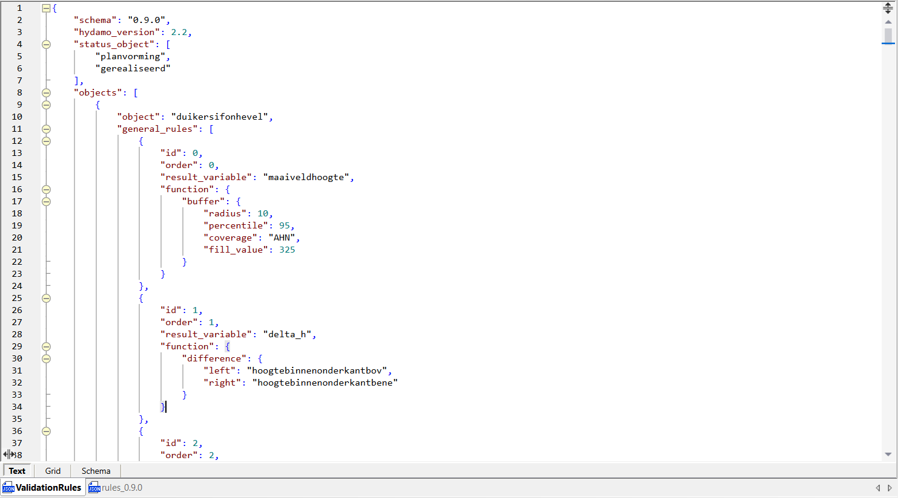
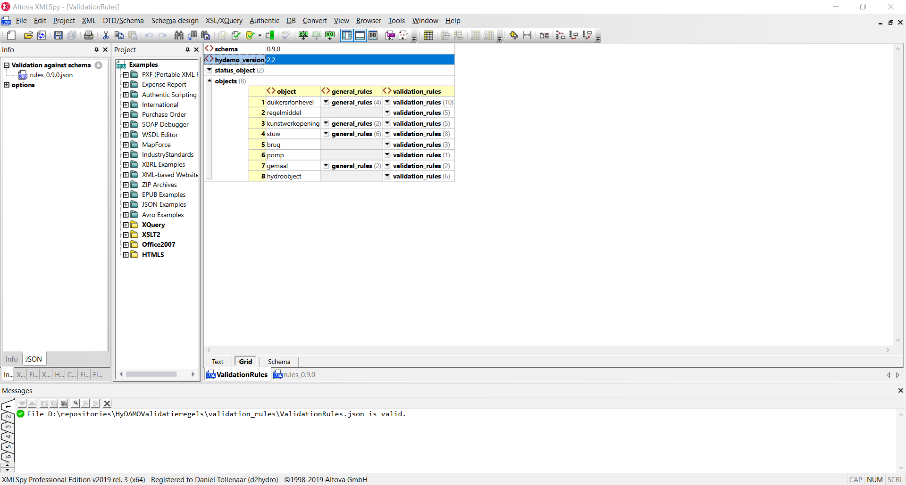
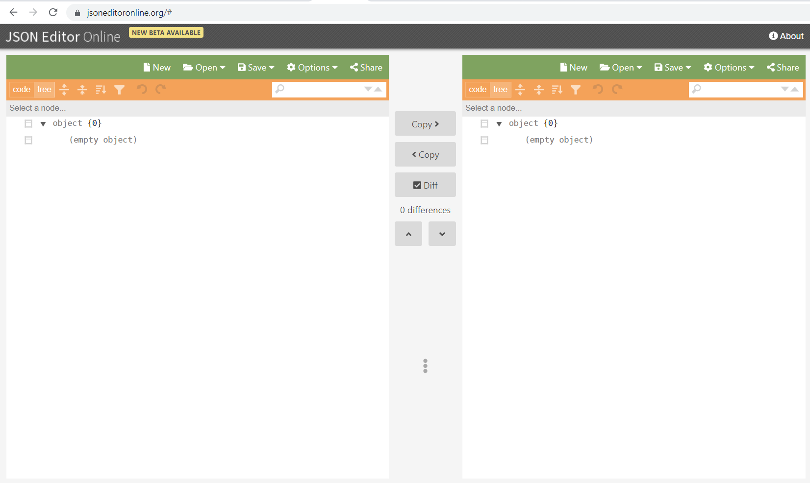
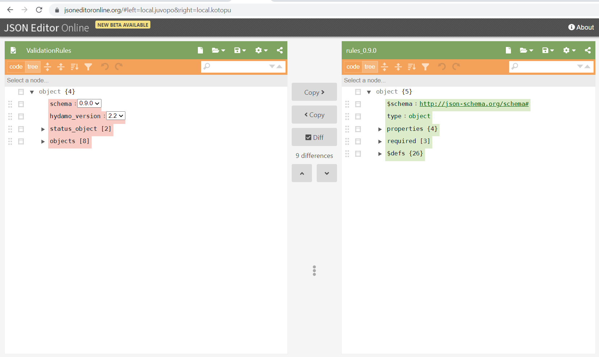

# Edit ValidationRules
In ValidationRules you define the (topo)logic rules that should be executed on your HyDAMO data. To edit rules you need two jsons:

1. The actual validation-rules as specified in: [ValidationRules.json](../../validation_rules/ValidationRules.json)
2. The [JSON-schema](../../schemas/rules_0.9.0.json) defining the structure of the ValidationRules.json.

Below we explain how you can edit ValidationRules with two packages that support JSON-schema validation:

* Altova XMLSpy
* JSON Editor Online

## Altova XMLSpy
For this you need a license to and a copy of [Altova XMLSpy] https://www.altova.com/xmlspy-xml-editor

The adantage of Altova XMLSpy: a text (top-image) and grid (bottom-image) view. The latter allows quick editting.

### Assign schema

1. Go to `Info` -> `JSON` -> and specify your JSON-schema with `Select JSON Schema`
2. Start editting. If you save you'll see if your ValidationRules.json is valid.

## Edit Online
Simply browse the website: [JSON Editor Online](https://jsoneditoronline.org)

The adantage of JSON Editor Online: it's free!

### Assign schema

1. Open your ValidationRules.json left: `open` -> `from disk`
2. Open your JSON-schema right: `open` -> `from disk`
3. Assign your JSON schema to ValidationRules: `Settings` -> `JSON-schema` -> `Document` -> select your rules-document
4. Start editing

